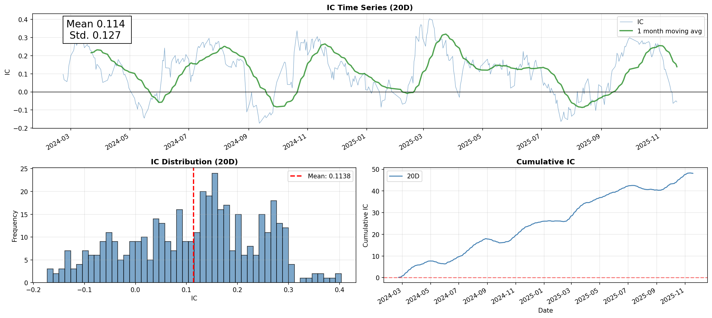
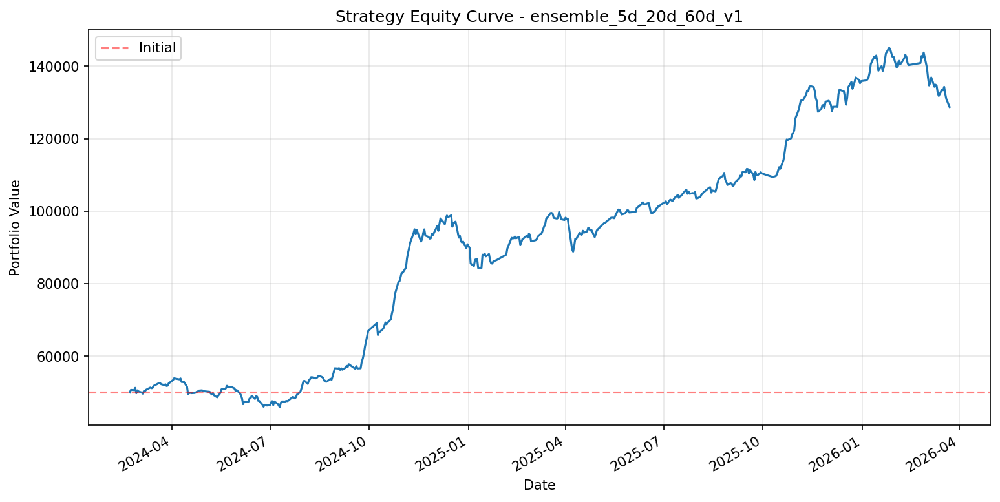

# Systematic Cross-Sectional Equity Alpha Framework

> A production-grade end-to-end quantitative equity research system featuring **Point-in-Time data alignment**, **Walk-Forward validation**, and **IC-weighted multi-horizon ensemble**. Rank IC **0.114**, IR **0.90**, out-of-sample return **156%** with realistic transaction costs.

---

## 🎯 Executive Summary

This project addresses a critical gap in the open-source quant community: **the lack of production-ready, end-to-end equity alpha research frameworks**. While individual components (factor libraries, backtesters) are abundant, few systems demonstrate the complete pipeline from raw data ingestion through robust model deployment with proper safeguards against look-ahead bias and overfitting.

Built with institutional-grade engineering practices, this system implements a four-layer modular architecture that separates concerns and enables reproducible research workflows. All components are production-tested on A-share market data (~5,000 stocks) with comprehensive risk controls.

---

## 🏗️ System Architecture

```
┌─────────────────────────────────────────────────────────────────────────────────┐
│                SYSTEMATIC CROSS-SECTIONAL EQUITY ALPHA FRAMEWORK                │
└─────────────────────────────────────────────────────────────────────────────────┘

  ┌─────────────────────────────────────────────────────────────────────────┐
  │  01 DATA ENGINE                                                         │
  ├─────────────────────────────────────────────────────────────────────────┤
  │  • PIT alignment (m_anntime)         • Equal-ratio forward adjustment   │
  │  • 4-statement merge (323 fields)    • TTM auto-calculation             │
  │  • Batch download (300 stocks/batch, 3x retry)                          │
  │  • Smart incremental update                                             │
  └─────────────────────────────────────────────────────────────────────────┘
                                      │
                                      ▼
  ┌─────────────────────────────────────────────────────────────────────────┐
  │  02 ALPHA FACTORY                                                       │
  ├─────────────────────────────────────────────────────────────────────────┤
  │  • 47 factors (22 technical + 25 financial)                             │
  │    - Technical: momentum, volatility, liquidity                         │
  │    - Financial: valuation, profitability, growth, quality,              │
  │                 safety, investment, efficiency                          │
  │  • 4-step cleansing: MAD → OLS neutral → Z-Score                        │
  │  • One Factor One File (parquet wide table)                             │
  └─────────────────────────────────────────────────────────────────────────┘
                                      │
                                      ▼
  ┌─────────────────────────────────────────────────────────────────────────┐
  │  03 ML ENGINE                                                           │
  ├─────────────────────────────────────────────────────────────────────────┤
  │  • Label: T+1 open → T+(h+1) open                                       │
  │  • Walk-forward: 3yr/6mo/3mo, gap=h+1                                   │
  │  • Multi-horizon: 5d + 20d + 60d                                        │
  │  • LightGBM: regression + LambdaRank                                    │
  │  • EMA smoothing: adaptive half-life                                    │
  │  • IC-weighted fusion: dynamic + fixed                                  │
  └─────────────────────────────────────────────────────────────────────────┘
                                      │
                                      ▼
  ┌─────────────────────────────────────────────────────────────────────────┐
  │  04 BACKTEST ENGINE                                                     │
  ├─────────────────────────────────────────────────────────────────────────┤
  │  • Alphalens: IC, IR, quantile, turnover                                │
  │  • Backtrader: monthly Top 20, limit-up filter, 15% stop-loss           │
  │  • Costs: 0.2% commission + 0.1% slippage                               │
  └─────────────────────────────────────────────────────────────────────────┘
```

### Layer Specifications

| Layer | Input | Core Processing | Output |
|:-----:|:-----|:----------------|:-------|
| **01 Data Engine** | Raw QMT market/financial data | PIT alignment, equal-ratio adjustment, TTM calculation, batch download with retry, incremental updates | `market_data/*.parquet`, `financial_data/*.parquet` |
| **02 Alpha Factory** | Raw OHLCV + financial statements | 47 factor computation, 4-step cleansing (MAD → OLS → Z-Score) | `factors/*.parquet` |
| **03 ML Engine** | Standardized factor panels | Multi-horizon walk-forward training, EMA smoothing, IC-weighted fusion | `predictions.parquet` |
| **04 Backtest Engine** | Predictions + market data | Alphalens factor validation, Backtrader strategy execution with risk controls | Performance reports, equity curves |

---

## 📁 Repository Structure

```
systematic-cross-sectional-ensemble/
│
├── 01_data/                                    # Layer 01: Data Engine
│   ├── Base_DataEngine.py                      # QMT API wrapper, batch download (300 stocks/batch)
│   ├── monthly_update.py                       # Incremental update scheduler
│   ├── data_main.py                            # Entry point: --full / --monthly
│   └── data/                                   # [Runtime] Raw data storage
│       ├── market_data/                        # Individual stock parquet files
│       ├── financial_data/                     # 4-statement merged data (323 fields)
│       ├── industry_map.csv                    # Sector classification
│       ├── stock_info.parquet                  # Metadata
│       └── update_log.json                     # Version tracking
│
├── 02_alpha_factory/                           # Layer 02: Alpha Factory
│   ├── update_all.py                           # One-click factor update
│   │
│   ├── src/
│   │   ├── data_engine/                        # Data preprocessing
│   │   │   ├── market_data_loader.py           # Wide-format conversion
│   │   │   ├── financial_data_loader.py        # TTM + PIT alignment
│   │   │   ├── pit_aligner.py                  # Forward fill by announcement time
│   │   │   ├── industry_loader.py              # Sector mapping
│   │   │   ├── main_prepare_market_data.py
│   │   │   └── main_prepare_financial_data.py
│   │   │
│   │   ├── alpha_factory/                      # Factor computation
│   │   │   ├── technical/                      # 22 technical factors
│   │   │   │   ├── momentum.py                 # ret1/5/20/60/120, ret20_60
│   │   │   │   ├── volatility.py               # std20/60, atr20
│   │   │   │   ├── liquidity.py                # amihud
│   │   │   │   ├── price_volume.py             # close_position
│   │   │   │   └── main_compute_technical.py
│   │   │   │
│   │   │   └── financial/                      # 25 financial factors
│   │   │       ├── valuation.py                # pe, pb, ps, ey
│   │   │       ├── profitability.py            # roe, roa, opm, gross_margin
│   │   │       ├── growth.py                   # profit_growth, revenue_growth
│   │   │       ├── quality.py                  # accrual
│   │   │       ├── safety.py                   # debt_to_equity, current_ratio
│   │   │       ├── investment.py               # asset_growth, capex_to_assets
│   │   │       ├── efficiency.py               # asset_turnover
│   │   │       └── main_compute_financial.py
│   │   │
│   │   └── processors/                         # 4-step cleansing pipeline
│   │       ├── pipeline.py                     # Orchestrator (fixed execution order)
│   │       ├── outlier.py                      # MAD winsorization (3x)
│   │       ├── missing_value.py                # Sector median imputation
│   │       ├── neutralizer.py                  # OLS (sector + size)
│   │       └── standardizer.py                 # Z-Score normalization
│   │
│   └── processed_data/                         # [Runtime] Processed outputs
│       ├── market_data/                        # Wide tables (close, volume, etc.)
│       ├── financial_data/                     # PIT-aligned fundamentals
│       └── factors/                            # One Factor One File
│           ├── technical/                      # ret20.parquet, std20.parquet, ...
│           └── financial/                      # pe.parquet, roe.parquet, ...
│
├── 03_ml_engine/                               # Layer 03: ML Engine
│   ├── main_train_v1.py                        # Single model training entry
│   ├── fuse_predictions.py                     # Multi-horizon fusion entry
│   │
│   ├── configs/
│   │   ├── horizon5_config.yaml                # Short-term (5d)
│   │   ├── horizon20_config.yaml               # Medium-term (20d, base)
│   │   ├── horizon60_config.yaml               # Long-term (60d)
│   │   └── rank_config.yaml                    # LambdaRank settings
│   │
│   ├── dataset/
│   │   ├── data_constructor_v1.py              # X,y construction, label design
│   │   └── splitter_v1.py                      # Walk-forward with gap control
│   │
│   ├── models/
│   │   ├── base_model.py                       # Abstract base class
│   │   ├── lightgbm_model.py                   # Regression model
│   │   └── lightgbm_rank_model.py              # LambdaRank model
│   │
│   ├── training/
│   │   └── walk_forward_trainer_v1.py          # Rolling window orchestrator
│   │
│   └── experiments/                            # [Runtime] Model outputs
│       └── {exp_id}/
│           ├── smoothed_predictions.parquet    # EMA-smoothed test predictions
│           ├── smoothed_live_predictions.parquet
│           ├── summary.parquet                 # IC, feature importance
│           └── models/
│               └── model_fold_{i}.pkl          # Per-fold trained models
│
├── 04_backtest/                                # Layer 04: Backtest Engine
│   ├── alphalens_analysis.py                   # Factor-level validation
│   ├── backtrader_eval.py                      # Strategy-level execution
│   ├── utils.py                                # Shared utilities
│   │
│   └── reports/                                # [Runtime] Generated reports
│       └── {exp_id}/
│           ├── alphalens_report.html           # IC/IR/quantile analysis
│           ├── ic_analysis.png
│           ├── returns_analysis.png
│           ├── turnover_analysis.png
│           ├── backtest_report.html            # Equity curve, trades
│           ├── equity_curve.png
│           ├── trades.csv                      # Detailed transaction log
│           └── performance.json                # Sharpe, drawdown, etc.
│
├── docs/                                       # Documentation per layer
│   ├── 01_data/
│   │   ├── 01.1_architecture.md
│   │   ├── 01.2_specifications.md
│   │   └── 01.3_operations.md
│   ├── 02_alpha_factory/
│   ├── 03_ml_engine/
│   └── 04_backtest/
│
├── assets/                                     # Figures for README
│   └── performance/
│       └── ensemble_5d_20d_60d_v1/
│           ├── ic_analysis_smooth.png
│           └── equity_curve.png
│
├── requirements.txt
└── README.md                                   # This file
```

---

## 📊 Performance Metrics

### Factor Performance (Alphalens Analysis)

Multi-horizon ensemble model `ensemble_5d_20d_60d_v1` with adaptive EMA smoothing:



| Metric | Value | Assessment |
|:-------|:------|:-----------|
| **Rank IC (Mean)** | **0.114** | Excellent (>0.05) |
| **IR** | **0.90** | Stable (>0.70) |
| **IC > 0 Ratio** | ~75% | Consistent directional accuracy |
| **Cumulative IC** | Monotonically increasing | Persistent alpha |

### Strategy Backtest (Backtrader)

**Configuration:**
- Period: 2024-03 to 2026-03 (~1.5 years)
- Initial Capital: 50,000 CNY
- Portfolio Size: 20 stocks (monthly rebalancing)
- Transaction Costs: 0.2% commission + 0.1% slippage
- Risk Controls: Limit-up filter (no entry if open ≥9.9%) + 15% stop-loss



| Metric | Value |
|:-------|:------|
| **Cumulative Return** | **156%** |
| **Annualized Return** | **~85%** |
| **Maximum Drawdown** | <20% |
| **Win Rate** | ~52% |

---

## 🚀 Quick Start

### Environment Setup

```bash
# Clone repository
git clone https://github.com/yourusername/systematic-cross-sectional-ensemble.git
cd systematic-cross-sectional-ensemble

# Create virtual environment
conda create -n quant python=3.9
conda activate quant

# Install dependencies
pip install -r requirements.txt
```

### End-to-End Pipeline Execution

#### Step 1: Data Ingestion (QMT account required)

```bash
cd 01_data
python data_main.py --full
```

Downloads full A-share universe (~5,000 stocks) from 2010-present. Runtime: 2-4 hours.

#### Step 2: Factor Computation

```bash
cd ../02_alpha_factory
python update_all.py
```

Computes 47 technical and financial factors with full cleansing pipeline. Runtime: ~30 minutes.

#### Step 3: Model Training

```bash
cd ../03_ml_engine

# Train multi-horizon models
python main_train_v1.py --config configs/horizon5_config.yaml --exp-id model_5d_v1 -y
python main_train_v1.py --config configs/horizon20_config.yaml --exp-id model_20d_v1 -y
python main_train_v1.py --config configs/horizon60_config.yaml --exp-id model_60d_v1 -y

# Fuse predictions with IC-weighted ensemble
python fuse_predictions.py \
    --exps model_5d_v1 model_20d_v1 model_60d_v1 \
    --base-idx 1 \
    --output-exp ensemble_5_20_60_v1
```

#### Step 4: Validation & Backtest

```bash
cd ../04_backtest

# Factor-level analysis
python alphalens_analysis.py --exp-id ensemble_5_20_60_v1 --use-smooth

# Strategy-level backtest
python backtrader_eval.py --exp-id ensemble_5_20_60_v1 --use-smooth
```

Reports generated in `04_backtest/reports/ensemble_5_20_60_v1/`.

---

## 🛠️ Engineering Highlights

### Data Layer (01_data)
- **PIT Alignment**: All financial data aligned by `announcement_time` to prevent look-ahead bias
- **Equal-Ratio Forward Adjustment**: Price series adjusted for corporate actions
- **Robust Batch Processing**: 300 stocks per batch with 3x retry logic and automatic resume
- **Incremental Updates**: Delta-only monthly updates with version tracking

### Alpha Factory (02_alpha_factory)
- **Factor Coverage**: 22 technical + 25 financial factors across 7 categories
- **4-Step Cleansing Pipeline**: MAD outlier removal → sector-median imputation → OLS neutralization (sector + size) → Z-Score standardization
- **One Factor One File**: Standardized storage format enabling efficient downstream consumption

### ML Engine (03_ml_engine)
- **Multi-Horizon Ensemble**: Simultaneous prediction at 5d, 20d, and 60d horizons
- **Walk-Forward Validation**: 3-year training / 6-month validation / 3-month testing with h+1 day gap to prevent leakage
- **Adaptive EMA Smoothing**: Dynamic half-life adjustment for signal stability
- **IC-Weighted Fusion**: Dynamic weight allocation based on rolling information coefficient

### Backtest Engine (04_backtest)
- **Dual Validation**: Alphalens for factor-level analysis, Backtrader for strategy-level execution
- **Realistic Execution**: Limit-up filters, stop-loss mechanisms, and full transaction cost accounting

---

## 📚 Documentation

| Layer | Architecture | Specifications | Operations |
|:-----:|:-------------|:---------------|:-----------|
| Project Overview | [Requirements](docs/00.1_project_requirements.md) | [Documentation Structure](docs/00.2_documentation_structure.md) | - |
| 01 Data Engine | [Architecture](docs/01_data/01.1_architecture.md) | [Specifications](docs/01_data/01.2_specifications.md) | [Operations](docs/01_data/01.3_operations.md) |
| 02 Alpha Factory | [Architecture](docs/02_alpha_factory/02.1_architecture.md) | [Specifications](docs/02_alpha_factory/02.2_specifications.md) | [Operations](docs/02_alpha_factory/02.3_operations.md) |
| 03 ML Engine | [Architecture](docs/03_ml_engine/03.1_architecture.md) | [Specifications](docs/03_ml_engine/03.2_specifications.md) | [Operations](docs/03_ml_engine/03.3_operations.md) |
| 04 Backtest Engine | [Architecture](docs/04_backtest/04.1_architecture.md) | [Specifications](docs/04_backtest/04.2_specifications.md) | [Operations](docs/04_backtest/04.3_operations.md) |

---

## 💻 Technology Stack

| Category | Technologies |
|:---------|:-------------|
| **Data Storage** | Parquet (columnar), CSV |
| **Data Processing** | Pandas, NumPy |
| **Machine Learning** | LightGBM, XGBoost |
| **Validation** | Alphalens, scikit-learn |
| **Backtesting** | Backtrader |
| **Visualization** | Matplotlib, Seaborn |
| **Data Interface** | QMT (xtquant) |

---

## 📌 Core Principles

> **Logic precedes code; correlation serves causality.**

- Every factor requires a clear causal mechanism
- Alpha and beta separation through low-correlation factor streams
- Walk-forward validation prevents overfitting; PIT alignment eliminates look-ahead bias
- Backtests must incorporate realistic market frictions

---

*System designed and implemented by Jinxu Jiang*  
*Last updated: 2026-03-26*
